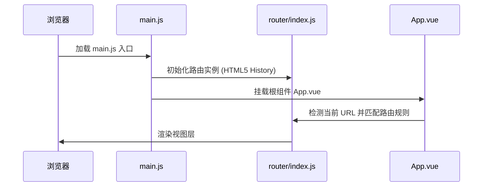
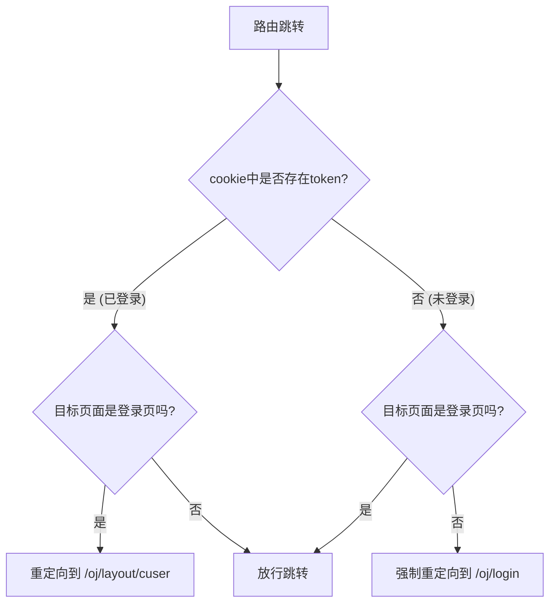

# CodeFlow OJ Admin - 架构设计与技术栈剖析

本页面详细阐述了项目的核心软件架构、目录模块划分、系统启动生命周期、路由守卫鉴权逻辑以及网络层的适配机制。

---

## 🏛️ 项目技术栈一览

* **核心框架**：Vue 3.5+ (采用 `<script setup>` 组合式 API 开发)
* **工程化构建**：Vite 6.2+ (利用 ESM 构建优势，实现毫秒级热更新)
* **组件库**：Element Plus 2.9+ (开启按需自动导入，无感接入)
* **状态与路由**：Vue Router 4.5+ (基于 HTML5 History 路由模式)
* **网络通信**：Axios 1.8+ (支持拦截器、自定义网络适配器及反向代理转发)
* **代码及内容编辑**：Ace-builds 1.39+ (Java 代码编辑) & Quill-editor 1.2+ (富文本描述)

---

## 📂 精细化目录树解析

```bash
oj-b/
├── docs/                             # 开发与设计文档归档
│   ├── architecture.md               # 架构设计与技术栈剖析
│   ├── development.md                # 开发者指引与业务开发规范
│   ├── style-guide.md                # 设计系统与 CSS 视觉规范
│   └── api-guide.md                  # API通信与网关对接规范
├── src/
│   ├── apis/                         # 后端交互层接口，统一按模块分发
│   │   ├── admin.js                  # 管理员账户鉴权相关接口
│   │   ├── cuser.js                  # 评测用户管理接口
│   │   ├── exam.js                   # 竞赛/比赛配置接口
│   │   └── question.js               # 题库及测试用例维护接口
│   ├── assets/                       # 全局资源与样式规范目录
│   │   ├── main.scss                 # 全局覆盖主题、交互及动画类样式
│   │   └── oj-logo.svg               # 系统 SVG Logo
│   ├── components/                   # 全局公用业务组件
│   │   ├── CodeEditor.vue            # Ace Editor 封装，自带只读、样式配置与加载安全队列
│   │   ├── QuestionDrawer.vue        # 添加/编辑题目抽屉，含拖拽文件上传与 Quill 编辑器
│   │   └── QuestionSelector.vue      # 题目难度下拉选择框，支持双向数据绑定
│   ├── router/                       # 路由控制器目录
│   │   └── index.js                  # 路由树定义与路由守卫（beforeEach）
│   ├── utils/                        # 核心工具类定义
│   │   ├── cookie.js                 # 基于 js-cookie 的用户凭证管理封装
│   │   ├── mockService.js            # Mock 拦截逻辑及数据生成引擎
│   │   └── request.js                # Axios 封装实例，含请求与响应拦截器
│   ├── App.vue                       # 项目根挂载视图，管理过渡动画与全局路由视图插槽
│   └── main.js                       # 前端入口文件，负责模块初始化与 Vue 实例挂载
```

---

## 🔄 核心生命周期与运行机制

### 1. 初始化挂载流程 (Bootstrap)
当用户访问系统时，加载生命周期如下：
1. 浏览器解析 [index.html](file:///Users/lujingxiang/VueProjects/Vue3/oj-b/index.html)，加载入口 [src/main.js](file:///Users/lujingxiang/VueProjects/Vue3/oj-b/src/main.js)。
2. [main.js](file:///Users/lujingxiang/VueProjects/Vue3/oj-b/src/main.js) 执行以下挂载步骤：
   - 导入 Vue 3 核心 `createApp`；
   - 实例化 App 根组件；
   - 挂载路由系统（`router`）；
   - 将应用实例绑定到 DOM 上的 `#app` 节点中。



---

### 2. 路由守卫与鉴权生命周期 (Authentication Guard)
为了保证系统的安全性，管理后台的路由跳转均会通过 [router/index.js](file:///Users/lujingxiang/VueProjects/Vue3/oj-b/src/router/index.js) 中定义的全局前置守卫 `beforeEach`。

#### 鉴权拦截逻辑设计：
1. **令牌检测**：利用 [cookie.js](file:///Users/lujingxiang/VueProjects/Vue3/oj-b/src/utils/cookie.js) 的 `getToken()` 获取本地令牌是否存在。
2. **已携带令牌 (`token` 存在)**：
   - 若用户试图访问登录页 `/oj/login`，防重复登录逻辑生效，将其重定向至默认主页 `/oj/layout/cuser`。
   - 若用户访问其他路由，直接放行（`next()`）。
3. **未携带令牌 (`token` 不存在)**：
   - 若用户访问登录页 `/oj/login`，放行。
   - 若用户试图访问非登录页，出于安全拦截，强制重定向至 `/oj/login` 进行登录。



---

### 3. 网络请求与数据流架构 (Networking Architecture)

网络层使用单独的 Axios 实例，封装在 [request.js](file:///Users/lujingxiang/VueProjects/Vue3/oj-b/src/utils/request.js) 中。数据请求与拦截流程如下图所示：

```
[UI 业务页面组件] (调用 apis/ 模块)
       │
       ▼
┌──────────────────────────────────────┐
│       utils/request.js 实例          │
│                                      │
│  1. 请求拦截器 (Request Interceptor)  │
│     - 检测 cookie.js 是否存在 token  │
│     - 若存在，请求头追加 Bearer 字段   │
│                                      │
│  2. 网络适配器转发 (Vite Proxy/Mock)   │
│     - 若 VITE_USE_MOCK = "true":     │
│       使用 Mock 适配器拦截并本地生成   │
│     - 若 VITE_USE_MOCK = "false":    │
│       转发至 Vite 开发反向代理网关    │
│                                      │
│  3. 响应拦截器 (Response Interceptor) │
│     - 检测状态码 code:               │
│       - 1000: 成功, 返回 data 载荷     │
│       - 3001: 登录过期, 自动清理凭证   │
│         并重定向至 /oj/login 页面    │
│       - 其他: 拒绝 Promise 抛出 msg   │
└──────────────────────────────────────┘
```

#### Mock 数据代理引擎：
在没有真实后端服务的离线/独立开发环境下，为实现完备的本地调试，系统提供了一个基于适配器的 Mock 请求拦截引擎 [mockService.js](file:///Users/lujingxiang/VueProjects/Vue3/oj-b/src/utils/mockService.js)。

当项目在开发配置文件 [.env.development.local](file:///Users/lujingxiang/VueProjects/Vue3/oj-b/.env.development.local) 中将 `VITE_USE_MOCK` 设为 `"true"` 时，网络实例会替换 Axios 的 `adapter`：
```javascript
if (import.meta.env.VITE_USE_MOCK === "true") {
    service.defaults.adapter = (config) => mockRequest(config);
}
```
* **核心机制**：该拦截器直接阻断了浏览器发送真实的 HTTP/TCP 请求，转而在本地运行虚拟路由器。它根据请求的 URL、方法和参数（例如 `FormData` 中的键值对），通过本地脚本生成契合后端规约的 JSON 数据，并将其包装为 Axios `Response` 结构返回给调用组件。
* **业务保障**：这确保了即使没有后端微服务支持，开发者也可以在纯前端环境中无缝测试登录、题目列表检索、用例文件上传、提交代码块等全套复杂交互逻辑。
